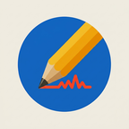
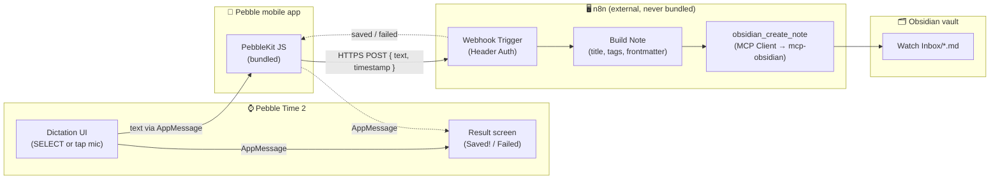

<h1 align="center">
  
  <br />
  Delta Notes
</h1>

<p align="center">
  <i>Dictate a note on your wrist, find it in your Obsidian vault seconds later — no phone typing, no manual copy/paste.</i>
</p>

<p align="center">
  <a href="LICENSE"></a>
  
  <a href="https://github.com/Delta-43/pebble-watch-obsidian-notes/commits/main"></a>
  <a href="https://github.com/Delta-43/pebble-watch-obsidian-notes/graphs/contributors"></a>
</p>

<p align="center">
  <a href="https://developer.repebble.com/"></a>
  
  <a href="docker/docker-compose.yml"></a>
  <a href="https://n8n.io/"></a>
  <a href="https://github.com/Delta-43/pebble-watch-obsidian-notes/actions/workflows/build-pbw.yml"></a>
  <a href="https://github.com/Delta-43/pebble-watch-obsidian-notes/releases/latest"></a>
</p>

<p align="center">
  
  
  <a href="https://apps.repebble.com/c2c541a7bc004712894f8d46"></a>
</p>

<p align="center">
  <a href="#how-it-works">How it works</a> •
  <a href="#why-this-design">Why this design</a> •
  <a href="#components">Components</a> •
  <a href="#tech-stack">Tech stack</a> •
  <a href="#project-status">Project status</a> •
  <a href="#quick-start">Quick start</a> •
  <a href="#project-structure">Project structure</a> •
  <a href="#documentation">Documentation</a> •
  <a href="#prerequisites">Prerequisites</a> •
  <a href="#license">License</a>
</p>

> **Live on the Pebble Appstore**: https://apps.repebble.com/c2c541a7bc004712894f8d46 — fully validated
> end-to-end on real hardware first (dictation, the phone bridge, the webhook, and the note landing in a
> real vault all confirmed on a real Pebble Time 2, not just an emulator — see
> [Project status](#project-status)).

**→ [`docs/SETUP.md`](docs/SETUP.md) has the full step-by-step deployment guide.** This README covers
the *what* and *why*; `docs/SETUP.md` is what you actually follow to build and deploy it yourself.

Sibling project to [`pebble-index-research-agent`](https://github.com/Delta-43/pebble-index-research-agent)
(the Pebble Index 01 ring → AI-researched-note pipeline), but deliberately much simpler: no web research,
no ring, just watch → text → vault note. Works fully standalone, or wired into that project's existing
n8n/`mcp-obsidian` backend.

---

## How it works



1. Press **SELECT**, or tap the mic icon on a touchscreen model — Core Devices' own on-watch Dictation
   API captures audio and returns transcribed text; this project's own code never touches audio.
2. The watch sends that text to the phone over Bluetooth (`AppMessage`); this watchapp's bundled
   PebbleKit JS reads the webhook URL + auth token from its Clay-generated config page and does a plain
   `XMLHttpRequest` `POST` to your n8n instance.
3. n8n's `Webhook Trigger` (protected by Header Auth) builds the note's title/tags/frontmatter and calls
   `obsidian_create_note` via its MCP Client node, which writes the file straight into `Watch Inbox/` in
   your vault.
4. n8n's response relays back to the watch as "Saved!" or a short failure reason.

The new note then syncs to your phone/desktop the same way any other vault change does — this project
doesn't touch sync itself, it only writes a file into whatever vault directory you point `mcp-obsidian` at.

## Why this design

- **No audio handling anywhere in this project's own code.** The Pebble SDK's Dictation API does the
  mic capture and cloud transcription itself; the watchapp only ever handles plain text. This was the
  single biggest unverified assumption going in — it's since been confirmed on real Pebble Time 2
  hardware, not just plausible from SDK docs.
- **A direct, authenticated webhook — not Obsidian LiveSync's own sync protocol.** Speaking LiveSync's
  chunked/E2EE replication protocol from watch-side JavaScript would be far more complex than "dictate a
  quick note" warrants. A plain HTTPS POST to an n8n Webhook Trigger is the standard-building-blocks
  equivalent.
- **No AI agent in the note-saving path.** Saving a dictated note is a deterministic action, not a
  reasoning task — the workflow calls `obsidian_create_note` directly via n8n's plain MCP Client node,
  not through an LLM-backed agent (unlike the research pipeline, which genuinely needs one).
- **Deliberately decoupled from the research pipeline.** Notes land in their own `Watch Inbox/` folder,
  not the ring project's `Index Inbox/`, so wiring research into watch notes later (if ever wanted) is an
  additive branch on the shared workflow JSON, not a rewrite.
- **n8n is always external, never bundled.** Same convention as the sibling project — this project's own
  `docker-compose.yml` never tries to run n8n itself, only the pieces specific to it (`mcp-obsidian`).
- **Reuse the sibling project's `mcp-obsidian` image rather than building a new one.** It's already
  published and already generic (`VAULT_NAME`/`VAULT_MOUNT` env vars, no ring-specific logic) — no reason
  to fork or rebuild it just for a different vault subfolder.
- **Touch support is capability-gated, not platform-gated.** The tap-to-record mic icon is compiled in
  wherever `PBL_TOUCH` is defined — a hardware capability check, not a check for "Pebble Time 2"
  specifically — so any future Core Devices touch-capable watch picks it up automatically.
- **Config page over a hardcoded webhook URL/token.** Required regardless of preference, since this is
  meant to be a *publicly published* watchapp — other installers need to point it at their own n8n, not
  the author's.

See [`docs/ARCHITECTURE.md`](docs/ARCHITECTURE.md) for the full reasoning, including what was tried,
what broke, and how each real finding was verified rather than assumed.

## Components

| Component | Project | Role |
|---|---|---|
| Watchapp | this repo, [`watchapp/`](watchapp/) | C app (dictation, result screen, tap-to-record icon) + bundled PebbleKit JS (webhook call, on-phone config page) |
| Obsidian tool | [`StevenStavrakis/obsidian-mcp`](https://github.com/StevenStavrakis/obsidian-mcp) | MCP server that writes the note directly onto the vault directory — reused from the sibling project's own published image, not rebuilt |
| Orchestration | [n8n](https://n8n.io/) | `Webhook Trigger` → `Build Note` (Set) → `obsidian_create_note` (MCP Client), no LLM involved — see [`n8n/workflows/delta-notes.json`](n8n/workflows/delta-notes.json) |
| Config UI | [Clay](https://github.com/pebble-dev/clay) | Generates the watchapp's on-phone settings page (webhook URL + auth token) — no hosting required |
| Phone bridge | [`coredevices/mobileapp`](https://github.com/coredevices/mobileapp) | Official Pebble mobile app — runs the watchapp's bundled PebbleKit JS, gives it network access and a config-page host |

## Tech stack

<table>
<tr><th>Layer</th><th></th></tr>
<tr><td>Watch (C)</td><td>
  
  
</td></tr>
<tr><td>Phone bridge</td><td>
  
  
</td></tr>
<tr><td>Orchestration</td><td>
  
  
</td></tr>
<tr><td>Infra</td><td>
  
</td></tr>
</table>

## Project status

**Published and live.** Fully validated end-to-end on real hardware, not just in an emulator: dictation via
Core Devices' cloud recognizer, the watch→phone AppMessage bridge, the phone's webhook call, and a real
note landing in a real Obsidian vault have all been confirmed on an actual Pebble Time 2. Touch
(tap-to-record) has been confirmed working on real hardware too. Every phase, including submission, is
done — install it from [apps.repebble.com](https://apps.repebble.com/c2c541a7bc004712894f8d46).

| Phase | Status | Detail |
|---|---|---|
| Watchapp core (dictation → AppMessage → result screen) |  | Phase 1 |
| Watch → phone AppMessage bridge |  | Phase 2 |
| PebbleKit JS (webhook POST + Clay config page) |  | Phase 3 |
| n8n workflow (`delta-notes.json`) |  | Phase 4 |
| Standalone `docker-compose.yml` |  | Phase 5 |
| End-to-end test (real vault/n8n, mocked dictation call) |  | Phase 6a — real note confirmed in vault; one real n8n expression-syntax bug found and fixed |
| Real dictation on Pebble Time 2 hardware |  | Phase 6b — the single biggest unverified assumption, now confirmed real |
| Real backend deployed against the user's own n8n/vault |  | Phase 6c |
| Docs (`SETUP.md`, `ARCHITECTURE.md`, `TROUBLESHOOTING.md`, this README) |  | Phases 8a–8b |
| Watch UI polish + icon assets |  | Phase 7 — verified on emery/chalk/flint emulators, no layout bugs found |
| App store submission prep (`docs/STORE_LISTING.md`, screenshots) |  | Phase 9 |
| Publish to the Core Devices/Rebble app store | [](https://apps.repebble.com/c2c541a7bc004712894f8d46) | Phase 10 — [live listing](https://apps.repebble.com/c2c541a7bc004712894f8d46) |

See [`TODO.md`](TODO.md) for the full phase-by-phase validation history — including two real bugs caught
and fixed along the way, and one real deployment incident (self-caught, root-caused, fixed) — if you want
the full evidence behind the "validated on real hardware" claim above.

## Quick start

Most people should just [install Delta Notes from the Pebble Appstore](https://apps.repebble.com/c2c541a7bc004712894f8d46)
— nothing to build. What follows is for building from source (contributing, or wanting the very latest
`main`); a pre-built `.pbw` is also attached to every [GitHub Release](https://github.com/Delta-43/pebble-watch-obsidian-notes/releases/latest)
if you just want to sideload without a local toolchain.

This covers the **standalone** backend path (you don't already run `pebble-index-research-agent`). For
the **integrated** path (reuse an existing `pebble-index-research-agent` deployment's `mcp-obsidian`), or
for full detail on either path, see [`docs/SETUP.md`](docs/SETUP.md).

```bash
git clone https://github.com/Delta-43/pebble-watch-obsidian-notes.git
cd pebble-watch-obsidian-notes/watchapp

# Build & install the watchapp (needs the Pebble SDK's pebble-tool)
python3 -m venv .venv
./.venv/bin/pip install pebble-tool
source .venv/bin/activate
pebble sdk install latest

pebble build
pebble install --phone <ip-address-from-developer-connection>
```

```bash
# Stand up the backend (mcp-obsidian only — n8n is assumed to already exist)
cd ../docker
cp .env.example .env    # fill in VAULT_PATH, VAULT_NAME, N8N_NETWORK_NAME
mkdir -p "$VAULT_PATH/.obsidian"   # obsidian-mcp refuses a vault without one
docker compose up -d
```

```bash
# Import the n8n workflow
docker cp ../n8n/workflows/delta-notes.json <your-n8n-container-name>:/tmp/delta-notes.json
docker exec <your-n8n-container-name> n8n import:workflow --input=/tmp/delta-notes.json
```

Then, in the n8n editor: attach a **Header Auth** credential to the imported `Delta Notes Webhook` node,
activate the workflow, and restart n8n (webhook routes only register at process boot). Finally, on your
phone, open Delta Notes' **Settings** in the Pebble app's Locker and enter the webhook URL + auth token.
Full detail on every one of these steps — including exact navigation paths for LAN Developer Connection
and what "Saved!" vs. a failure reason means — is in [`docs/SETUP.md`](docs/SETUP.md).

## Project structure

```text
pebble-watch-obsidian-notes/
├── README.md                  # this file
├── LICENSE                    # AGPLv3
├── CLAUDE.md                  # living build summary for AI agents picking this repo up
├── PLAN.md                    # original design intent — the "why" behind the shape, pre-build
├── TODO.md                    # phase-by-phase build/validation checklist
├── watchapp/
│   ├── src/c/                 # one module per responsibility (see watchapp/CLAUDE.md refactor note):
│   │   ├── main.c              #   window lifecycle, wires the modules below together
│   │   ├── status_display.*    #   on-screen result text + its revert timer
│   │   ├── note_transport.*    #   AppMessage to/from the phone
│   │   ├── dictation_handler.* #   the DictationSession itself
│   │   └── mic_icon.*          #   tap-to-record icon, compiled in only when PBL_TOUCH is defined
│   ├── src/pkjs/               # PebbleKit JS: AppMessage handler, XHR POST, Clay config page
│   │   ├── index.js
│   │   └── config.json         # Clay config-page field definitions
│   ├── resources/images/       # app_icon.png, mic_icon.png — rasterized from design/ source art
│   └── package.json            # app UUID, display name, target platforms, message keys
├── docker/
│   ├── docker-compose.yml      # standalone path: mcp-obsidian only, external n8n network, no host ports
│   └── .env.example
├── n8n/
│   └── workflows/delta-notes.json   # Webhook Trigger (Header Auth) → Build Note → obsidian_create_note
├── design/                     # right-sized, committed design source (app icon PNGs, mic icon SVG)
└── docs/
    ├── SETUP.md                # both deploy paths, phase-by-phase
    ├── ARCHITECTURE.md         # the why behind every decision, and what was verified rather than assumed
    └── TROUBLESHOOTING.md      # real errors hit while building this, with exact causes and fixes
```

## Documentation

| Doc | What's in it |
|---|---|
| [`docs/SETUP.md`](docs/SETUP.md) | Step-by-step deployment guide — building the watchapp, both backend deployment paths, wiring up n8n, configuring the watchapp itself |
| [`docs/ARCHITECTURE.md`](docs/ARCHITECTURE.md) | The *why* behind every design decision, and what was verified (and how) rather than assumed |
| [`docs/TROUBLESHOOTING.md`](docs/TROUBLESHOOTING.md) | Real errors hit while building this, with exact causes and fixes — check here first if something breaks |
| [`docs/STORE_LISTING.md`](docs/STORE_LISTING.md) | App store submission prep — manifest fields, icons, screenshots, listing copy, and what's still an open item for the actual submission portal |
| [`PLAN.md`](PLAN.md) | The original design intent, agreed before any code was written — historical record of *why*, not a live doc |
| [`TODO.md`](TODO.md) | Phase-by-phase build and validation checklist, including real bugs and one real deployment incident found along the way |
| [`CLAUDE.md`](CLAUDE.md) | Living summary for AI coding agents picking up work on this repo — current state, key decisions, working conventions |

## Prerequisites

- A mic-equipped Pebble watch (Pebble Time, Time Steel, Time Round, Pebble 2, Pebble 2 Duo, or Core
  Devices' Pebble Time 2), paired with the [Pebble mobile app](https://github.com/coredevices/mobileapp)
- An Obsidian vault, reachable as a plain directory from wherever you run `mcp-obsidian` — how it gets
  there (Self-hosted LiveSync, Syncthing, iCloud Drive, or Obsidian just running locally) is outside this
  project's scope
- Docker Engine + the Compose plugin
- An existing, self-hosted n8n instance

## License

[GNU AGPLv3](LICENSE) — matches the sibling project: this is self-hosted software, and AGPL's
network-use clause means anyone running a modified version of the backend as a service for others must
also share their modified source, closing the "SaaS loophole" plain GPL leaves open.

---

<p align="center">
  <a href="https://github.com/Delta-43/pebble-watch-obsidian-notes/graphs/contributors">
    
  </a>
</p>

<p align="center"><sub>Licensed under <a href="LICENSE">GNU AGPLv3</a>.</sub></p>
